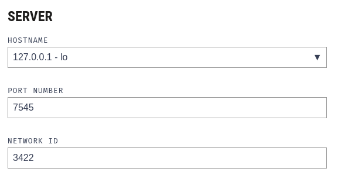
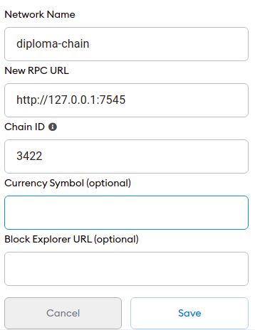
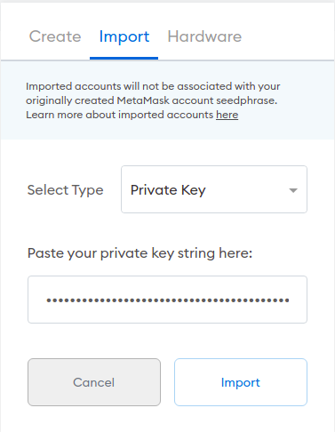

# Diplomachain: an Ethereum-based DAPP for diplomas authenticity


An Ethereum-based solution for INSAT students to gain control over their diplomas and university related certificated, so they can forward them to recruiters, or potential employer, in a secure and an authentic way. 


## The Problem

The papers based diplomas is an old method to prove that a person had acquired knowledge in a specified field. In our current world, those type of papers can be forged, stolen, lost or destroyed which leads to problems for their holders. Also, due to our fast-paced lifestyle we can't rely on this type of proof as it take several days to exchange them with their demanders thus paper based diploma are becoming obsolete.   


## The solution

To answer the previous sited problems, Digital diploma can not only reduce the risks related to papers based diploma, but we can use them to provide a detailed history of our learning path in a secure and decentralized manner. The control over those digital diploma will be transparent to their issuers, holders and also for whom may want to verify them.

## Scenario Basic 

Once interesting scenario that can take place using Digital diplomas, is an employer verifying the diplomas/certificates for a job candidate. In the traditional way, the employer must interact with the institute and verify by phone or via email the authenticity of the provided papers, this process is prone to human mistakes, and also it can be a mundane tasks to do it for several candidates. 

Using Diplomachain, the verification process will take few minutes, and it includes 3 steps:

1. The student/ job candidate send his digital diploma to the employer
2. The employer visit Diplomachain website, choose the verification feature, and upload the provided file
3. After waiting for few seconds, the employer gets the verification result back 


---
## Solution Components

The solution consist of two components,
a smart contract that include all the logical behavior related to issuing, requesting and verifying digital diploma, and a web application to facilitate the interaction between the non-technical user and the blockchain network


#### Smart Contract

The Smart contract is developed using Solidity, the default programming language for Ethereum smart contract, the contract exposes the functions that handle the application logic, those functions will be invoked from the web application and then executed within the Ethereum nodes.

The smart contract functions:


```solidity
function verifyDiploma(Diploma memory diploma) public view returns (bool)

function getDiploma(bytes32 diplomaId) public view returns (Diploma memory)

function addStudent(
        string memory _firstName,
        string memory _lastName,
        string memory _email,
        bytes32[] memory _diplomas
)

function getStudent(address student_addr) public view returns (Student memory)

function removeDiplomaItem(Diploma[] storage array, uint256 index)

function validateDiploma(bytes32 _id)

function issueDiploma(
        address owner,
        bytes32 blueprintId,
        string memory _honors,
        uint256 _dateObtained
)

function isStudent() public view returns (bool)

function isAdmin() public view returns (bool)

function getDiplomaIndex(bytes32 diplomaId) public view returns (uint256)

function getStudents() public onlyAdmin view returns (Student[] memory)

function getDiplomas() public onlyAdmin view returns (Diploma[] memory)

function getStudentDiplomas(address studentId) public view returns (Diploma[] memory)

function getStudentPendingDiplomas(address studentId) public  onlyStudent view returns (Diploma[] memory)

function requestDiploma(
        bytes32 blueprintId,
        string memory _honors,
        uint256 _dateObtained
    )

function getPendingDiplomas() public view returns(Diploma[] memory)

function addDiplomaBlueprint(
        string memory title,
        string memory description,
        string memory speciality,
        bytes32[] memory _diplomas
    )

function getDiplomaBlueprint(bytes32 id) public view returns (DiplomaBluePrint memory)

function getDiplomaBlueprints()public view returns (DiplomaBluePrint[] memory)

function getDiplomasByBlueprint(bytes32 id) public onlyAdmin view returns (Diploma[] memory)
```


#### Web Appplication

The web application is angular based front-end application, used to interact with the local blockchain network throught the functionalities provided by the Web3 library.

The application user interface is based on the [Material dashboard angular](https://www.creative-tim.com/product/material-dashboard-angular2) (the free version) created by creative team


---
## Quick Start

This guide will provide the necessary steps to run the project locally.

### Prerequisite

Binaries
* [nodejs](https://nodejs.org/en/)
* [truffle](https://www.trufflesuite.com/truffle)
* [angular](https://angular.io/guide/setup-local#install-the-angular-cli)

Extension
* [Metamask](https://metamask.io/) extension

Software

* [ganache](https://www.trufflesuite.com/ganache)

### Steps

The guide is divided into X major steps:
* Running the local Ethereum network environment
* Deploying the smart contract
* Running the web application

## Setup

We start by cloning the repository and changing the working directory
```
git clone https://github.com/JoePiano/diplomachain
cd Diplomachain
```


To install the decencies needed for web application, We execute
```
cd web_client && npm install
```


## Local Ethereum network

To have a local Ethereum network we need to install the ganache, we can download the software and follow the installation instructions from the official website : https://www.trufflesuite.com/ganache

After installing ganache, We choose new workspace

We specify the name of the workspace, and we add truffle object by navigating to the ```Diplomachain/blockchain``` directory  and choosing the file ```truffle-config.js``` 


Using server tab, we change the **network id** to ```3422``` 



Saving the workspace will result in the interface where we can interact with the blockchain networks, by default ganache created 10 accounts to be used for blockchain transactions. It provides 6 tabs

* Accounts: contains the 10 created account with their address and private keys + mnemonic, which used to create the account and to sign the transaction in the network
* Blocks: List the blocks mined, each block will contain several transactions
* Transactions: List the transaction executed on the blockchain
* Contract: list the contract deployed in the blockchain  (by importing the truffle-config file we can see the project smart contracts)
* Events: List the event emitted from the smart contracts functions
* Logs: Contain the execution logs for the network, can be useful for troubleshooting 


Now we have a local Ethereum blockchain running, which we will interact with it through the web application


## Deploying the smart contract

To use the provided functionalities we must deploy the smart contract, so it can be available for interactions

In our smart contract we have the admin role, which will be assigned to the account used when deploying the smart contract, and for these reasons we need to copy the mnemonic and paste it in the `build.sh` file under `Diplomachain/blockchain/ci`


```
// build.sh file content
...
ganache-cli -m "HERE GOES YOUR MNEMONIC" > /dev/null &
...
```

After changing the mnemonic in the build.sh file, under the `Diplomachain/blockchain`, to compile and deploy the smart contract, we execute 

```
truffle compile --all && truffle deploy --reset
```

This command will result in rich log, which lists all details related to the deployment transaction, gas usage, ETH spent and smart contract address, Also we can check the contracts tab in ganache to verify if the smart contract is well deployed. 

## Running the web application


To run the front end application in development mode execute

```bash
cd web_client
ng serve
```

To interact with the application  visit:

```
http://localhost:4200
```
As mentioned above, the application features require the metamask extension to create a wallet and to have an Ethereum address used for transactions.

To install the meta mask extension we can refer to https://metamask.io/ ,it is supported on multiple browsers like Chrome, firefox, Edge and Brave


After installing the extension, create an account, store the provided passphrase in a secure location and configure a custom RPC connection to interact with the local blockchain network (created by ganache)



After configuring the RPC connection in metamask, we must import the first address provided by ganache, it will be used as the **admin address**, also we can import other addresses to be used for students accounts 



---

## Role & Features

The Diplomachain application include 3 roles

* Admin
    The admin is able to:
    - Create diploma blueprint
    - Issue diplomas
    - Validated dipoma request
* Student
    The student is able to:
    - List his received diplomas
    - Request a diploma from the admin
    - Download the diploma (JSON file)
* Verifier:
    The verifier is able to
    - Verify a Diploma by uploading the correspondent JSON file

For extra details on how each role can use the application please refer to the [user guide](./docs/user_manual.md) 
