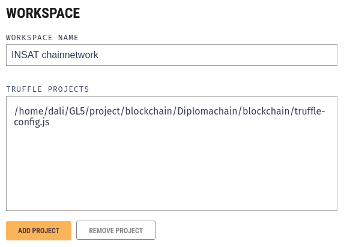

# Diplomachain: an Ethereum-based DAPP for diplomas authenticity


An Ethereum-based solution for INSAT students to gain control over their diplomas and university related documents to recruiters, individuals etc., in a secure and authentic way. 


## The Problem

The papers based diplomas are quite old method to prove that someone had acquired knowledge in some field. In our current world, those type of papers can be forged, stolen, lost or destroyed leading to more problems for their holders. Also, due to our fast-paced lifestyle we can rely on this type of proof as it take several days to exchange papers with their demanders thus making paper based diploma quite obsolete.   


## The solution

To answer the previous sited problems, Digital diploma can not only reduce the risks related to papers based diploma, but we can use them to provide a detailed history of our learning path in a secure and decentralized manner. The control over those digital diploma will be transparent to their issuers, holders and also for whom want to verify them.

## Scenario Basic 

Once interesting scenario that can take place using Digital diplomas, is an employer verifying the diplomas/certificates for a job candidate. In the traditional way, the employer must interact with the institute and verify by phone or via email the authenticity of the provided papers, this process is prone to human mistakes, and also it turns to be a mundane tasks to do it for several candidates. 

Using Diplomachain, the verification process will take a few minutes, it includes 3 steps:

1. The student/ job candidate send his digital diploma to the employer
2. The employer visit Diplomachain website, choose the verification feature, and upload the provided file
3. After a Few seconds, the employer gets his response back 


---
## Quick Start

This guide will provide the necessary steps to run the project locally.

### Prerequisite

Binaries
* [nodejs](https://nodejs.org/en/)
* [truffle](https://www.trufflesuite.com/truffle)
* [angular](https://angular.io/guide/setup-local#install-the-angular-cli)

Extension
* [Metamask](https://metamask.io/) extension

Software

* [ganache](https://www.trufflesuite.com/ganache)

### Steps

The guide is divided into X major steps:
* Running the local Ethereum network environment
* Deploying the smart contract
* Running the web application

## Setup

We start by cloning the repository and changing the working directory
```
git clone <LINK>
cd Diplomachain
```


To install the decencies needed for web application, We execute
```
cd web_client && npm install
```


## Local Ethereum network

To have a local Ethereum network we need to install the ganache, we can download the software and follow the installation instructions from the official website : https://www.trufflesuite.com/ganache

After installing ganache, We choose new workspace

We specify the name of the workspace, and we add truffle object by navigating to the ```Diplomachain/blockchain``` directory  and choosing the file ```truffle-config.js``` 



Using server tab, we change the **network id** to ```3422``` 


Saving the workspace will result in the interface where we can interact with the blockchain networks, by default ganache created 10 accounts to be used for blockchain transactions. It provides 6 tabs

* Accounts: contains the 10 created account with their address and private keys + mnemonic, which used to create the account and to sign the transaction in the network
* Blocks: List the blocks mined, each block will contain several transactions
* Transactions: List the transaction executed on the blockchain
* Contract: list the contract deployed in the blockchain  (by importing the truffle-config file we can see the project smart contracts)
* Events: List the event emitted from the smart contracts functions
* Logs: Contain the execution logs for the network, can be useful for troubleshooting 


Now we have a local Ethereum blockchain running, which we will interact with it through the web application


## Deploying the smart contract

To use the provided functionalities we must deploy the smart contract, so it can be available for interactions

In our smart contract we have the admin role, which will be assigned to the account used when deploying the smart contract, and for these reasons we need to copy the mnemonic and paste it in the `build.sh` file under `Diplomachain/blockchain/ci`


```
// build.sh file content
...
ganache-cli -m "HERE GOES YOUR MNEMONIC" > /dev/null &
...
```

After changing the mnemonic in the build.sh file, under the `Diplomachain/blockchain`, to compile and deploy the smart contract, we execute 

```
truffle compile --all && truffle deploy --reset
```

This command will result in rich log, which will list all details related to the deployment transaction, gas usage, ETH spent and smart contract address, Also we can check the contracts tab in ganache to verify if the smart contract is well deployed 

## Running the web application
