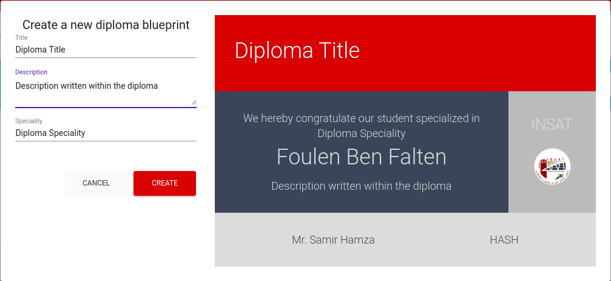
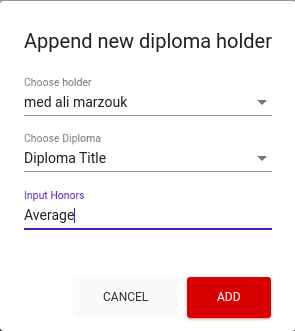
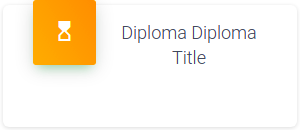
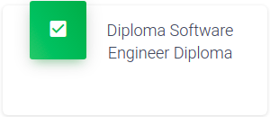
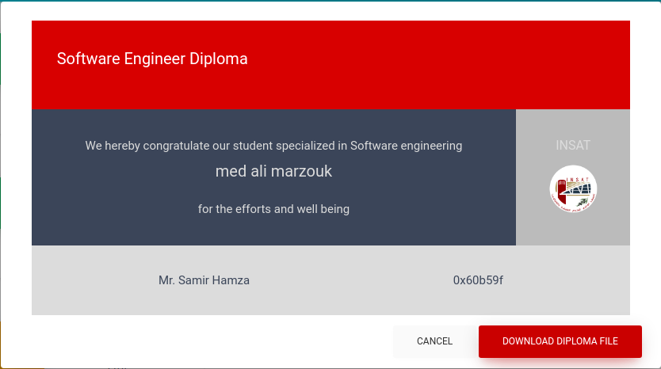
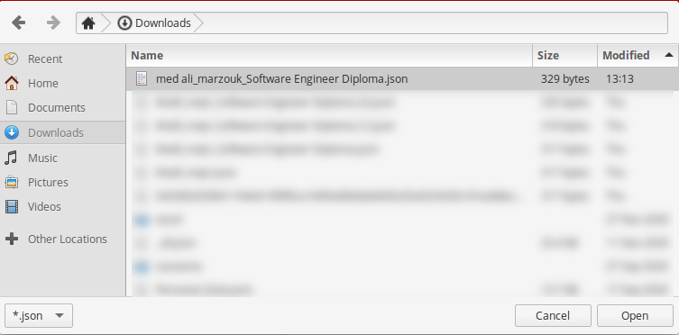

# Diplomachain User Manual

## Created for the diplomachain beta version - Jan 2021   

## Content Table
- [Introduction](#intro)
- [Glossary](#glossary)
- [Aim & Audience](#aim)
- [Admin Role](#admin)
    - Create digital diploma blueprint
    - Issue digital diploma
    - Accept digital diploma
- [Student Role](#student)
    - Request a digital diploma
    - Download digital diploma file
- [Verifier Role](#verifier)
    - Verify digital diploma
- [Conclusion](#end)

## Introduction 

### This document provide in a detailed manner a guide for diplomachain users. As a platform for issuing & requesting digital diploma, there is three main roles. Each role has a set of features and for each feature we detail the steps needed to use it. 

### All provided details in this document refer to the feature existing in the beta verison of the diplomachain platform, future changes may introduce updated user manuals for the new features or for the problem fixes

### For easier navigation through the document, please refere to the content table.

## Glossary 

* **Ethereum** : public blockchain network, with support for smart contracts

* **Smart Contract** : A digital contract, implemented by a specialized programming language, and executed in the blockchain network nodes

* **Transaction** : The transfer of a value from one entity to another, in the Ethereum context, it refers to the blockchain transaction.

* **Digital diploma** : A certificate with a digital format, issued by the correspondent authority and verifiable by third parties. 

* **Issuing** : Providing a student/holder with a signed digital diploma.

* **Diploma blueprint** : In diplomachain, the blueprint is diploma type, that contains a set of values for the diploma attributes. It serves as a reference when issuing diplomas

* **Diploma Request** : The process of demanding to receive a diploma from the platform admin

* **Diploma verification** : The process of verifying the digital diploma, by interacting with the blockchain network, checking that the diploma is stored and that the provided values the stored values 

## Aim & Audience 

The aim of this user manual is to facilitate the usage of the diplomachain platform. it is designed to explain consecutive steps to use each feature within the platform, and for maximum clarity the document contains a good number of screenshots and visual elements

To make the document accessible for everyone, we focused on simplisity when exlaining the step and considered both new and experience technology users.

This user manual contains the explaination and steps required to use the features per role:

* Admin:   
    The Diplomachain admin is the supervisor of the platform activities, the only legit user with diploma issue privileges, an admin can
    * Issue a digital diploma 
    * Accept digital diploma requests
    * Create digital diploma blueprint
* Student:    
    In Diplomachain, the student represent the diploma holder. a student is able to:
    - Request a digital diploma
    - Download digital diploma file
* Verifier:    
    The verifier role represent any tiers interacting with the platform to verify a received digital diploma
    - Verify a digital diploma
    

## Admin Role 

The admin for the diplomachain platform, will use the web application to create the diploma blueprint for each seperate diploma type, issue diploma for students/holders in bulk, validate diploma requests after a verification phase with the insitute administration. 

### Create digital diploma blueprint

To be able to issue a diploma, it is required for the admin to create the diploma blueprints. This phase is divided into these following steps

#### 1. Navigate to the admin dashboard

Select the right part of the admin dashboard by referring to component header

Use the add button to pop-up the blueprint form

#### 2. Fill the blueprint creation form

The blueprint creation form requires three inputs, the diploma title, diploma description and the diploma specialty. Also it include a visual representation of the diploma that will change accordinaly to the provided inputs.

After filling the form the admin initiate it is creation by clicking on

#### 3. Validate Transaction

After filling the blueprint diploma form, and clicking on the create button, a metamask windows will pop up, and the admin is required to confirm the Ethereum transaction

After confirming the transaction, the diploma blueprint will be added to the blockchain storage, and it will show within the blueprints list

The newly created blueprint can now be used when issuing a digital diploma by the admin or when requesting a digital diploma by the student

### Issue digital diploma

Diplomachain main feature is issuing digital diploma. For this reasons the diplomachain developer aimed to simplify the process in the aim of mitigating humans errors

#### 1. Navigate to the issuing dashboard

Within the admin dashboard, the admin can use this button to navigate to the issuing page

The issuing page contain a list of diploma drafts, that will be used when issuing the diplomas by the admin

To add a diploma draft , we click on 

#### 2. Fill the add diploma holder form

After clicking on the add button, a diploma form will pop up, the admin select the diploma holder, choose the diploma blueprint and provied the extra inputs.

#### 3. Validate the diploma to issue

After filling the diploma form, a new diploma draft is appended to the diploma drafts list

We can reduce the diplomas draft list by removing elements (clicking on the trash button)

After verifying the diplomas values, the admin inititate the issuing process through the issue button

For each seperate diploma creation the admin required to confirm the ethereum transaction through the poped up metamask window

After validating the transaction, the diploma will be created and added to the holder diplomas list.

### Accept digital diploma

Validating diploma is the solely admin responsabilites, after verifying the diploma demandes with the institues administration, the platform admin can validate. 

#### 1. Navigate to the diploma requests

In the admin dashboard, navigate to the requests list component, which will contain all requested diplomas with their provided details

#### 2. Select the requests to validate

The admin selected the requests to be validate, by clicking on the green rounded button next to request details

otherwise, to remove the added requests, the admin click on the red button

#### 3. Validate the selected requests

After selecting the requests to be validated, the admin  initiate the validation phase by clicking on the validate button

For each request validation request, the admin confirm the correspondant ethereum transaction. After validation the request, a new diploma will be added to the holder diplomas list

## Student Role 

The student is the main client of the diplomachain platform. Student is able the download the already issued diplomas and able to request a diploma from the platform admin

### Request a digital diploma

A student request a diploma, and in case the diploma request get validated by the admin, it will be added to his list of diplomas

#### 1. Navigate to the student dashboard

Navigate to the diplomas list in the student dashboard

focusing on the component header 

To request a diploma, student can click on the add button

#### 2. Fill the diploma request form

After clicking on the add button, the student can fill up the form, by selecting the wanted diploma and providing other diploma values.

To execute the request transaction, the student must click on the request button

After requesting the diploma, the student confirm the etherum transaction

#### 3. Check if the diplomas list

After requesting the diploma, the student can check his list of diploma to find his requested diploma in pending state.

### Download digital diploma file

In the aim of forwarding a received digital diploma, the student download a chosen digital diploma.

#### 1. Navigate to the student dashboard

Student navigate to the diplomas list

#### 2. Select the needed diploma

Click on the chosen diploma

A diploma modal will pop-up, it contains the diploma details within a visual representation

#### 3. Download the diploma file

Clicking on the download button

initiate the download of the diploma file

Any modification in the downloaded file will result in corrupted diploma, that will be invalid in the verification process

## Verifier Role 

The verifier role, is assigned for each visitor of the Diplomachain platform, verifying a diploma doesn't require an Ethereum address.

### Verify digital diploma

#### 1. Navigate to the verification page
 
Visit the verification page, it contains animation elements to notify the user with the progress of the verification process and the form used to upload the file

#### 2. Upload the file

To upload the file, either the user can use the upload file input, or drag and drop the diploma file

- Uploading file

Clicking on the upload file button will open the popup to select the file from the machine

Selecting the diploma to verify, it must be a JSON file

- Drag & drop

Otherwise we can drag & drop the file, draging the selected file to the verification box will trigger the application to upload the file 

#### 3. Validate

After uploading the file, the view of the form changes to include the file name

Now, the user can execute the verification process, by click on the verify button

Depending on the provided diploma, either a valid diploma or an invalid diploma, the user can know the result through the progress indicators elements

For a valid diploma, all the indicators get filled with green color

Otherwise, the last verification step will be filled in red color

If any problems occurred during the process, the correspondent indicators will be also filled in red color

## Conclusion 

### In this document, we went through the different role in the diplomachain platform, detailed the features and their usage steps. each step contained a small description and few screenshots to faciliate the user understanding.
